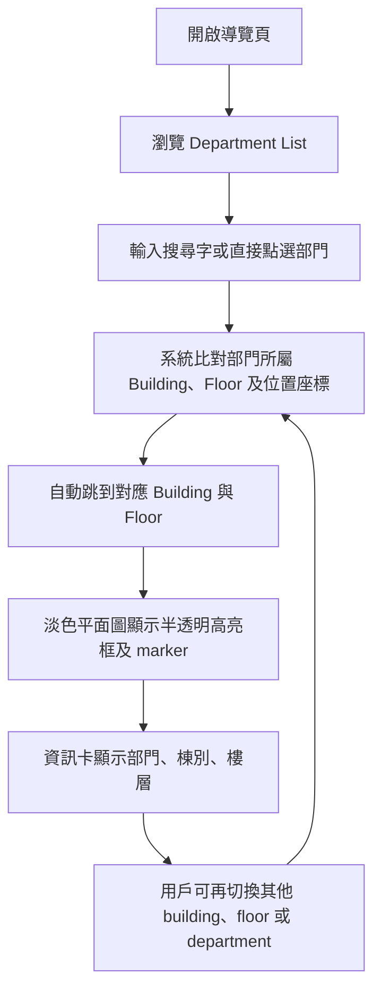

## 1. 產品概述
呢個 prototype 係一個「商場路線圖風格」嘅多棟多層互動導覽頁，俾用戶由 Department List 揀選部門後，自動跳到對應 Building 同 Floor，並喺淡色底圖上清晰顯示位置。
- 主要解決多張樓層圖難以管理、部門原圖太深色難睇、訪客難以快速定位目標部門嘅問題，對象包括訪客、前台、內部同事同設施管理人員。
- 價值係將多棟多層靜態圖紙整合成商場 directory 體驗，方便日後擴充真實底圖、樓層切換、導航路線同 kiosk 顯示。

## 2. 核心功能

### 2.1 使用角色
| 角色 | 使用方式 | 核心權限 |
|------|----------|----------|
| 一般用戶 | 直接打開頁面 | 查看平面圖、揀選部門、查看位置高亮 |
| 前台/管理員 | 直接打開頁面 | 用 Department List 快速指示訪客位置 |

### 2.2 功能模組
1. **互動導覽頁**：Building tabs、樓層切換、平面圖展示、部門高亮、資訊卡。
2. **部門清單面板**：部門列表、搜尋框、顏色標記、跨棟跨層快速跳轉。

### 2.3 頁面詳細
| 頁面名稱 | 模組名稱 | 功能描述 |
|-----------|-------------|---------------------|
| 互動導覽頁 | 頂部資訊列 | 顯示系統名稱、Building 數、樓層數、提示文字 |
| 互動導覽頁 | Building Tabs | 顯示各棟 building，支持手動切換 |
| 互動導覽頁 | Floor Switcher | 顯示當前 building 之下所有樓層 |
| 互動導覽頁 | Department List | 顯示 department 名稱、編號、building 同 floor |
| 互動示意頁 | 搜尋框 | 輸入名稱或編號後篩選清單 |
| 互動導覽頁 | 平面圖展示區 | 以淡色商場路線圖風格顯示當前樓層 |
| 互動導覽頁 | 高亮框層 | 點選部門後以半透明有色框及 marker 顯示位置 |
| 互動導覽頁 | 資訊卡 | 顯示所選部門名稱、編號、所屬 building/floor 與簡短說明 |

## 3. 核心流程
用戶打開頁面後，先喺左側清單見到全部 Department；可直接撳選某個部門，或者先搜尋再揀選。當揀選完成，系統會自動切換到對應 Building 同 Floor，並喺淡色平面圖上顯示對應顏色嘅半透明高亮區及 marker，同步更新資訊卡。用戶亦可以手動切換 building 或 floor，檢視同一棟內不同樓層配置。

## 4. 使用者介面設計
### 4.1 設計風格
- 主色：米白、淺灰、柔和藍灰，模仿商場 directory 底圖
- 強調色：綠色、紫色、桃紅、藍色，僅用作選中部門高亮
- 按鈕風格：圓角 tab、清晰 active 狀態、輕陰影
- 字體：繁體中文介面字體，清晰易讀，偏資訊導覽 kiosk 風格
- 版面風格：左側清單，中間地圖，右側資訊；中間上方加入 building/floor 導航
- 圖示風格：簡潔線性圖示，突出建築、樓層、定位

### 4.2 頁面設計概覽
| 頁面名稱 | 模組名稱 | UI 元素 |
|-----------|-------------|-------------|
| 互動導覽頁 | 頂部資訊列 | 系統名、building/floor 統計、導覽說明 |
| 互動導覽頁 | Building Tabs | 圓角切換掣、棟別標籤、active 狀態 |
| 互動導覽頁 | Floor Switcher | 垂直樓層掣、當前樓層突出顯示 |
| 互動導覽頁 | Department List | 搜尋欄、可點擊卡片、building/floor 標記、active 狀態 |
| 互動導覽頁 | 平面圖展示區 | 淡色底圖、走廊、房間輪廓、半透明高亮框、marker |
| 互動導覽頁 | 資訊卡 | 選取摘要、building/floor、快速導航提示 |

### 4.3 響應式
以桌面版為主，支援平板橫向使用；若畫面變窄，building tabs 會保留於上方，floor switcher 會轉成橫向排列，保持平面圖可視面積。
