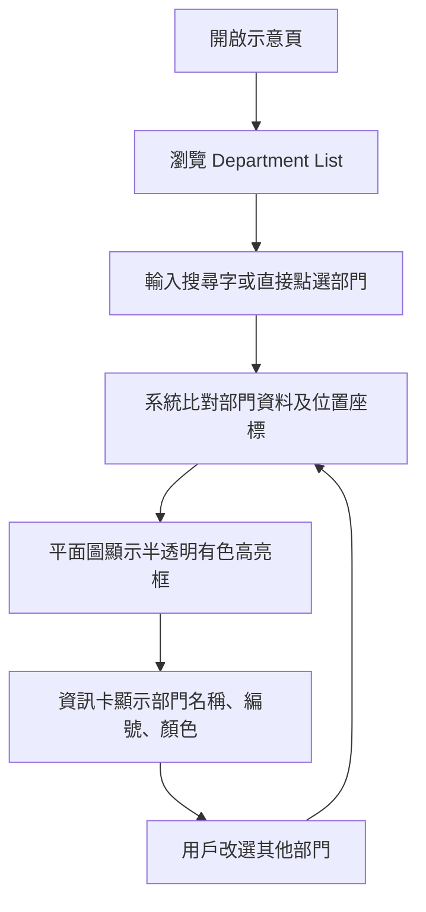

## 1. 產品概述
呢個 prototype 係一個「部門定位互動平面圖」示意頁，俾用戶由 Department List 揀選部門，喺樓層平面圖上即時高亮顯示位置。
- 主要解決平面圖難睇、部門位置唔容易快速識別嘅問題，對象包括訪客、前台、內部同事同設施管理人員。
- 價值係將靜態圖紙變成可互動介面，方便日後擴充搜尋、圖例、樓層切換同 kiosk 顯示。

## 2. 核心功能

### 2.1 使用角色
| 角色 | 使用方式 | 核心權限 |
|------|----------|----------|
| 一般用戶 | 直接打開頁面 | 查看平面圖、揀選部門、查看位置高亮 |
| 前台/管理員 | 直接打開頁面 | 用 Department List 快速指示訪客位置 |

### 2.2 功能模組
1. **互動示意頁**：平面圖展示、部門高亮、部門資訊卡。
2. **部門清單面板**：部門列表、搜尋框、顏色標記、快速切換。

### 2.3 頁面詳細
| 頁面名稱 | 模組名稱 | 功能描述 |
|-----------|-------------|---------------------|
| 互動示意頁 | 頂部資訊列 | 顯示系統名稱、樓層名稱、提示文字 |
| 互動示意頁 | Department List | 顯示 `27.01`、`07.03`、`27.03` 及其名稱與顏色 |
| 互動示意頁 | 搜尋框 | 輸入名稱或編號後篩選清單 |
| 互動示意頁 | 平面圖展示區 | 以底圖顯示樓層平面圖 |
| 互動示意頁 | 高亮框層 | 點選部門後以半透明有色框顯示位置 |
| 互動示意頁 | 資訊卡 | 顯示所選部門名稱、編號、顏色與簡短說明 |

## 3. 核心流程
用戶打開頁面後，先喺左側清單見到全部 Department；可直接撳選某個部門，或者先搜尋再揀選。當揀選完成，右側平面圖會出現對應顏色嘅半透明高亮區，並同步更新資訊卡。再次揀選其他部門時，高亮位置會切換到新部門。

## 4. 使用者介面設計
### 4.1 設計風格
- 主色：深藍灰、白色、玻璃感淺灰
- 強調色：綠色、紫色、粉紅，對應部門高亮
- 按鈕風格：圓角、輕微陰影、hover 發光
- 字體：繁體中文介面字體，清晰易讀，偏 kiosk / dashboard 風格
- 版面風格：左側控制面板 + 右側大圖展示，桌面優先
- 圖示風格：簡潔線性圖示，突出定位與篩選

### 4.2 頁面設計概覽
| 頁面名稱 | 模組名稱 | UI 元素 |
|-----------|-------------|-------------|
| 互動示意頁 | 頂部資訊列 | 系統名、樓層名、狀態標籤、輕量玻璃效果 |
| 互動示意頁 | Department List | 搜尋欄、可點擊卡片、顏色小點、active 狀態 |
| 互動示意頁 | 平面圖展示區 | 大尺寸圖像、疊加高亮框、標籤與定位說明 |
| 互動示意頁 | 資訊卡 | 選取摘要、部門色票、狀態說明 |

### 4.3 響應式
以桌面版為主，支援平板橫向使用；若畫面變窄，左側面板會收窄或移至上方，保持平面圖可視面積。
