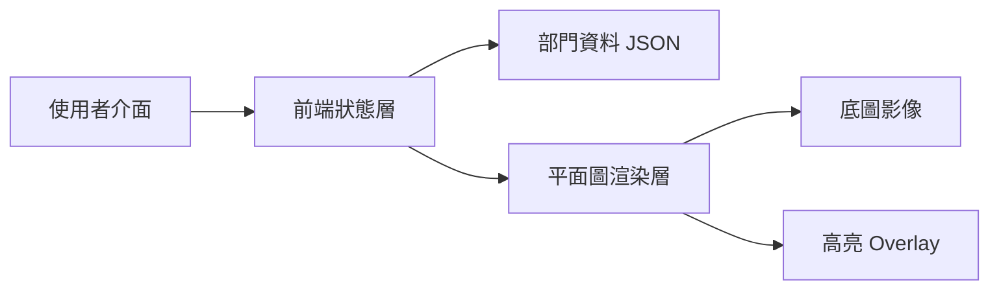
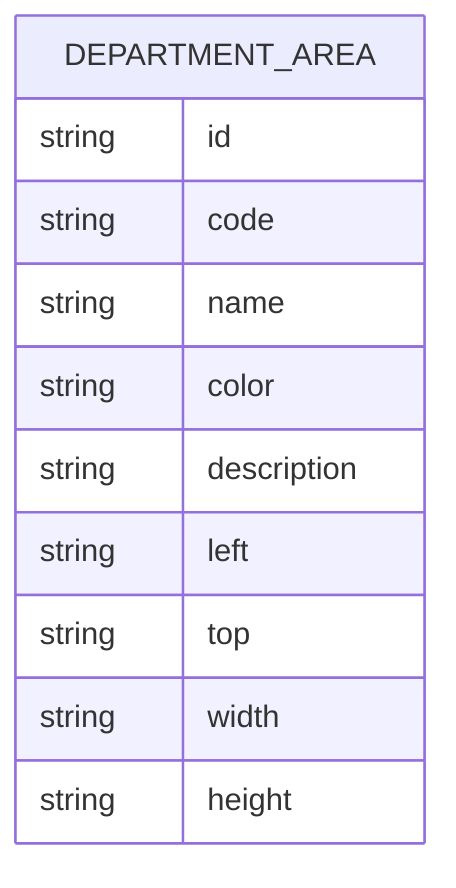

## 1. 架構設計


## 2. 技術描述
- 前端：React 18 + TypeScript + Tailwind CSS + Vite
- 初始化工具：vite-init
- 後端：None，prototype 以前端靜態資料運作
- 資料來源：本地 mock data，包含 Department 名稱、編號、顏色、位置座標

## 3. 路由定義
| 路由 | 用途 |
|-------|---------|
| / | 顯示部門定位互動平面圖 prototype |

## 4. API 定義
本 prototype 唔設後端 API，前端直接讀取本地資料。

```ts
type DepartmentArea = {
  id: string;
  code: string;
  name: string;
  color: string;
  description: string;
  bounds: {
    left: string;
    top: string;
    width: string;
    height: string;
  };
};
```

## 5. 資料模型
### 5.1 資料模型定義


### 5.2 前端模組拆分
| 模組 | 職責 |
|------|------|
| `src/pages/HomePage.tsx` | 組合整個 prototype 頁面 |
| `src/components/DepartmentList.tsx` | 顯示搜尋及部門列表 |
| `src/components/FloorMap.tsx` | 顯示平面圖及高亮 overlay |
| `src/components/DepartmentDetails.tsx` | 顯示目前選取部門資訊 |
| `src/data/departments.ts` | 儲存 mock data |
| `src/store/useDepartmentStore.ts` | 管理搜尋與選取狀態 |

## 6. 實作重點
- 使用絕對定位 overlay 疊加喺平面圖之上，做出半透明有色框效果。
- 清單同平面圖以同一份資料驅動，確保名稱、顏色同位置一致。
- 預留資料結構方便日後擴充多個樓層、更多部門或 tooltip/popup。
- Prototype 階段先以靜態資料同單頁應用完成示意，之後可接駁後台或資料庫。
