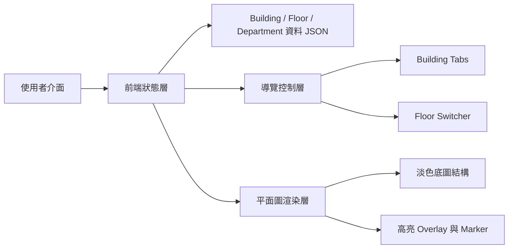
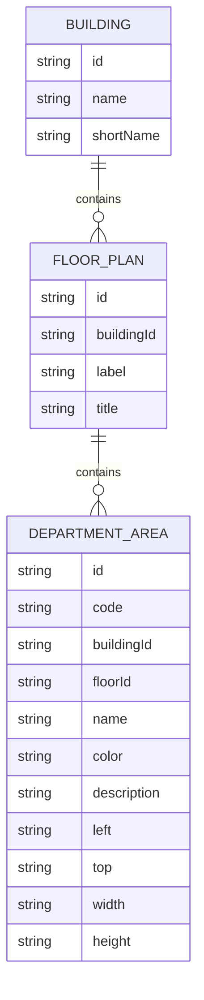

## 1. 架構設計


## 2. 技術描述
- 前端：React 18 + TypeScript + Tailwind CSS + Vite
- 初始化工具：vite-init
- 後端：None，prototype 以前端靜態資料運作
- 資料來源：本地 mock data，包含 Building、Floor、Department 名稱、編號、顏色、位置座標

## 3. 路由定義
| 路由 | 用途 |
|-------|---------|
| / | 顯示部門定位互動平面圖 prototype |

## 4. API 定義
本 prototype 唔設後端 API，前端直接讀取本地資料。

```ts
type Building = {
  id: string;
  name: string;
  shortName: string;
};

type FloorPlan = {
  id: string;
  buildingId: string;
  label: string;
  title: string;
  hallway: Array<{ left: string; top: string; width: string; height: string }>;
  blocks: Array<{ left: string; top: string; width: string; height: string }>;
};

type DepartmentArea = {
  id: string;
  code: string;
  buildingId: string;
  floorId: string;
  name: string;
  color: string;
  description: string;
  bounds: {
    left: string;
    top: string;
    width: string;
    height: string;
  };
};
```

## 5. 資料模型
### 5.1 資料模型定義


### 5.2 前端模組拆分
| 模組 | 職責 |
|------|------|
| `src/pages/Home.tsx` | 組合整個多棟多層導覽頁面 |
| `src/components/BuildingTabs.tsx` | 顯示 building 切換 tab |
| `src/components/FloorSwitcher.tsx` | 顯示當前 building 所有樓層 |
| `src/components/DepartmentList.tsx` | 顯示搜尋及部門列表 |
| `src/components/FloorMap.tsx` | 顯示淡色平面圖及高亮 overlay |
| `src/components/DepartmentDetails.tsx` | 顯示目前選取部門資訊 |
| `src/data/directory.ts` | 儲存 building、floor、department mock data |
| `src/store/useDirectoryStore.ts` | 管理搜尋、building、floor 與選取狀態 |

## 6. 實作重點
- 使用 building、floor、department 三層資料模型驅動導覽流程。
- 當用戶於清單揀選部門時，store 會同步更新 selectedDepartment、selectedBuilding 同 selectedFloor，做到自動跳位。
- 平面圖底色改為淡色商場 directory 風格，未選中部門不以深色填滿，只保留淡輪廓與高亮 overlay。
- Prototype 階段先以靜態資料同單頁應用完成示意，之後可逐層接駁真實底圖影像或 SVG。
